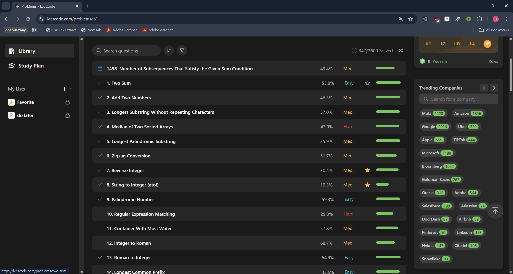
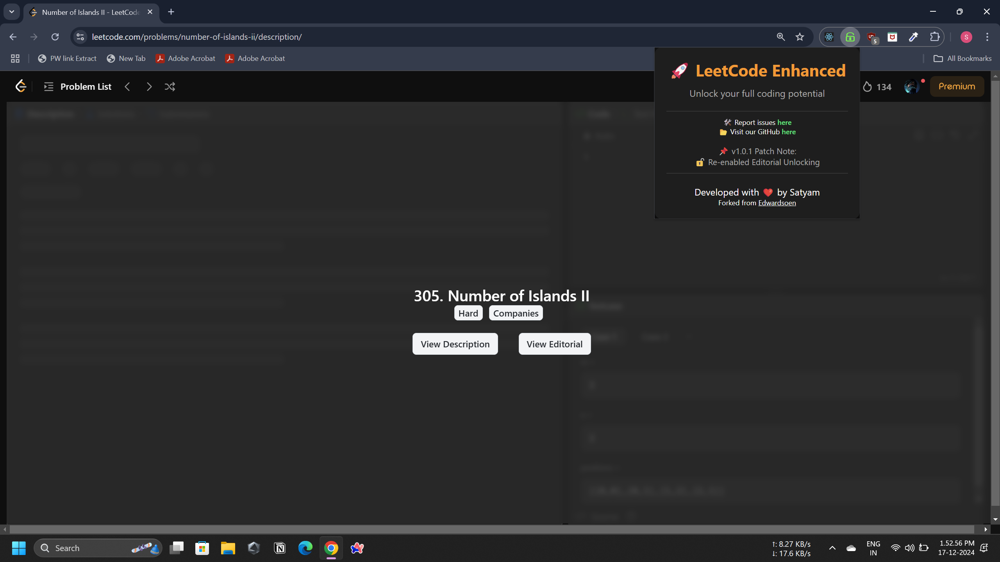
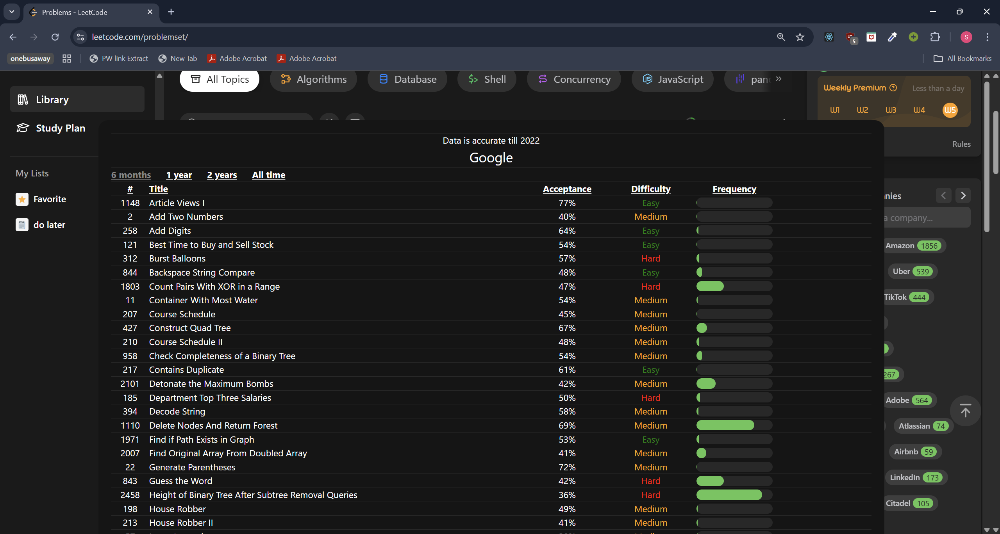
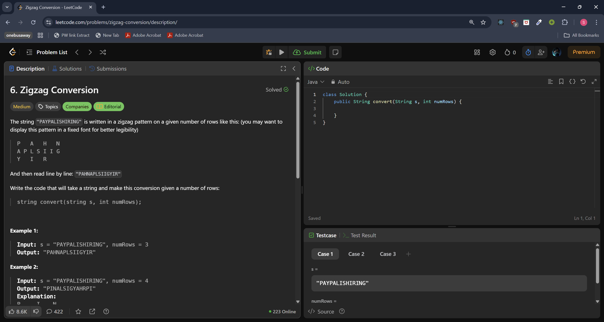

# Leetcode Enhancer

[](https://github.com/Satyam709/LeetcodeEnhancer)

Enhance your Leetcode experience with additional features and tools to make problem-solving more efficient and insightful!

[Report Bug](https://github.com/Satyam709/LeetcodeEnhancer/issues) · [Request Feature](https://github.com/Satyam709/LeetcodeEnhancer/issues)

---

## Leetcode Enhancher

Unlock Leetcode premium features without the need for a subscription or login.

### Features

- **Display Problem Frequency**: See how often a problem has been asked in interviews.
- **Unlock Company-Specific Problems**: Gain access to problems from specific companies (usually restricted to premium users).
- **Sort Company Problems**: Organize company problems by ID, name, difficulty, acceptance rate, and frequency.
- **Unlock Premium Problem URLs**: Access URLs to premium problems directly without a subscription.
- **View Premium Problems**: Directly view premium content that is typically behind a paywall.
- **Company Info on Problem Page**: View company names associated with each problem on the problem page.
- **Editorial Access**: Unlock access to premium problem editorials and solutions.
- **Cross-Browser Support**: Available for both Chrome and Firefox browsers.

---

### Screenshots

Here are some screenshots showing the features of Leetcode Enhancer in action:









---

## Contributing

We welcome contributions to improve Leetcode Enhancer! If you find any bugs or have ideas for new features, feel free to open an issue or submit a pull request.

### Steps to Contribute:

1. Fork the repository.
2. Create a new branch for your feature/fix.
3. Commit your changes and push to your fork.
4. Create a pull request with a description of what you've done.

---

## License

Leetcode Enhancer is open-source and released under the [MIT License](https://opensource.org/licenses/MIT).

---

## Disclaimer

Leetcode Enhancer is an unofficial project and is not endorsed or affiliated with Leetcode in any way. It merely enhances the user experience by providing additional features that are normally available only to premium subscribers.

---

## Support

If you need any help, have questions, or want to report an issue, please feel free to reach out:

- [Open an Issue](https://github.com/Satyam709/LeetcodeEnhancer/issues)

---

## How to Build

To build the extension from source:

1. **Install dependencies**
   ```bash
   pnpm install
   ```

2. **Build the extension**
   ```bash
   pnpm build
   ```

This will create the built extension files ready for installation in both Chrome and Firefox.

---

## Installation

### Chrome Installation

1. **Download the Chrome ZIP file**
   - Go to the [Releases](https://github.com/Satyam709/LeetcodeEnhancer/releases) page of this repository.
   - Download the latest `leetcode-enhancer-chrome-v2.0.0.zip` file.

2. **Extract the ZIP file**
   - Extract the contents of the `.zip` file to a folder on your computer.

3. **Load the Extension into Chrome**
   - Open Google Chrome.
   - Navigate to `chrome://extensions/`.
   - Enable **Developer Mode** (toggle switch in the top-right corner).
   - Click **Load unpacked**.
   - Select the folder where you extracted the extension.

### Firefox Installation

1. **Download the Firefox ZIP file**
   - Go to the [Releases](https://github.com/Satyam709/LeetcodeEnhancer/releases) page of this repository.
   - Download the latest `leetcode-enhancer-firefox-v2.0.0.zip` file.

2. **Load the Extension into Firefox**
   - Open Firefox.
   - Navigate to `about:debugging`.
   - Click **This Firefox**.
   - Click **Load Temporary Add-on**.
   - Select the zip or extacted folder as required.

### Usage

4. **Use the Extension**
   - The extension will now be loaded in your browser and ready to use.
   - You can pin the extension to the toolbar for quick access.
   - Visit Leetcode.com to see the enhanced features in action.

---

## Notes

- If you encounter theme coloring issues, just set the theme in Leetcode to manual rather than system.
- The extension works on various Leetcode pages including problem sets, individual problems, and study plans.

---

## Changelog

### v2.0.0 (Latest)

- **Firefox Support**: Added support for Firefox browser with dedicated Firefox manifest.
- **Enhanced Editorial Access**: Improved access to premium editorials and solutions.
- **Better Error Handling**: Added analytics and error tracking for improved stability.
- **Code Optimization**: Refactored codebase with modular architecture for better maintainability.
- **Cross-Browser Compatibility**: Ensured consistent functionality across Chrome and Firefox.

### v1.0.0

- Initial release.
- Basic premium feature unlocking.
- Company-specific problem access.
- Problem frequency display.
